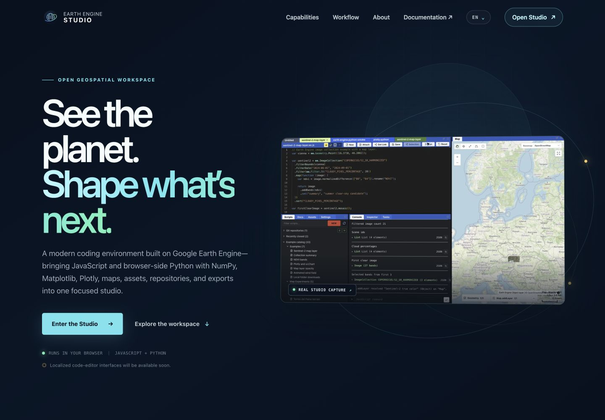
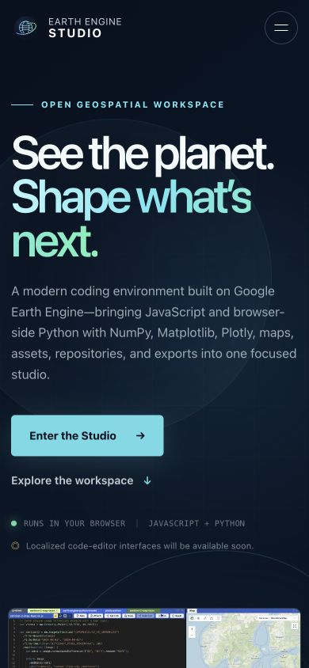
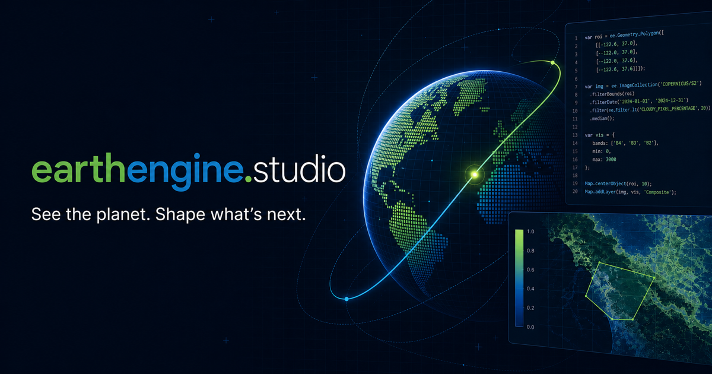
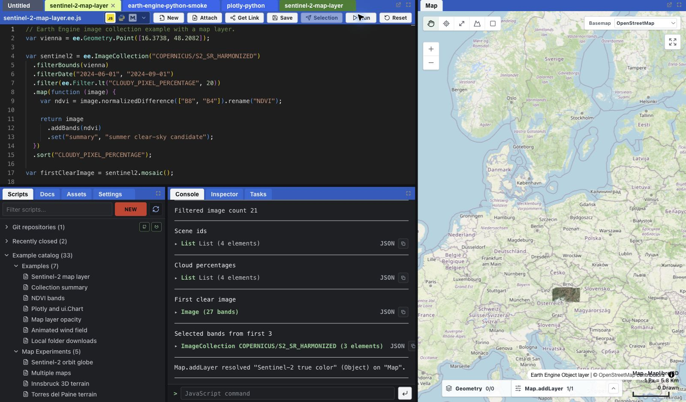
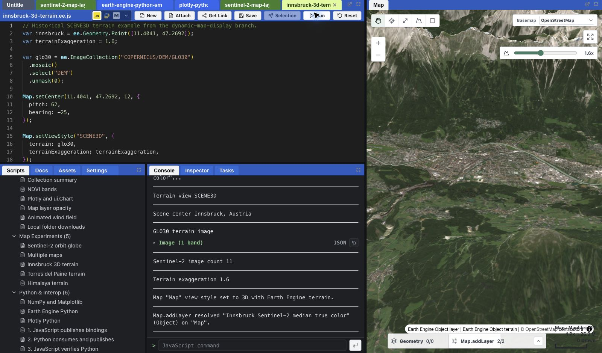
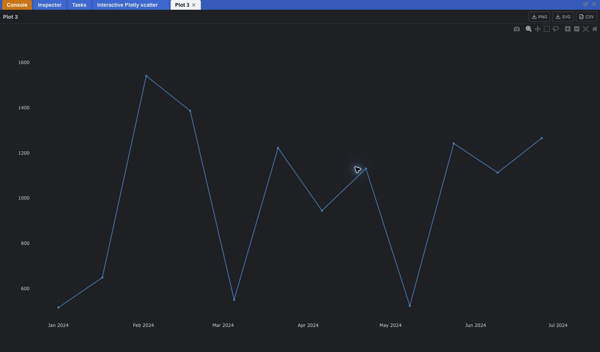

# Screenshot and visual replacement guide

This guide inventories every raster screenshot used by the website, the current
reference captures, and the product views that should be recaptured when the
Studio interface changes. It also separates real image files from the
screenshot-like interface illustrations that are currently built in HTML and
CSS.

## Current image inventory

| Image | Role | Published | Required size | Replace when |
| --- | --- | --- | --- | --- |
| `assets/images/social-card.png` | Link preview for social networks and chat | Yes | `1200 × 630` PNG | Brand, headline, or primary product visual changes |
| `docs/screenshots/landing-desktop.png` | Desktop design reference | No | `1440 × 1000` PNG | Desktop layout, copy, color, or hero changes |
| `docs/screenshots/landing-mobile.png` | Mobile design reference | No | `390 × 844` PNG | Mobile layout, menu, copy, or hero changes |
| `docs/screenshots/product-sentinel-workspace.png` | Real editor, Console, and 2D map reference | No | `1600 × 940` PNG | Studio layout or map workflow changes |
| `docs/screenshots/product-innsbruck-terrain.png` | Real editor, Console, and 3D map reference | No | `1600 × 940` PNG | Studio 3D view or terrain controls change |
| `docs/screenshots/product-plotly-output.png` | Real maximized Plotly output reference | No | `1600 × 940` PNG | Figure tabs, controls, or export workflow changes |
| `assets/images/product/hero-workspace.webp` | Real editor, Console, scripts, and map hero | Yes | `1600 × 940` WebP | Sentinel workflow or Studio layout changes |
| `assets/images/product/map-workspace.webp` | Real JavaScript, Console, and 3D terrain card | Yes | `1600 × 940` WebP | Studio 3D view or terrain controls change |
| `assets/images/product/output-workflow.webp` | Real Plotly output card | Yes | `1600 × 940` WebP | Figure tabs, controls, or export workflow changes |
| `assets/images/orbit-studio.svg` | Logo and favicon | Yes | Vector SVG | Brand mark changes; this is not a screenshot |

All files under `docs/screenshots/` are documentation references only. Jekyll
does not publish them because the `docs` directory is excluded in `_config.yml`.

## Current page references

### Desktop landing page

### Mobile landing page

### Social sharing card

## Real Studio capture references

These safe reference captures were made from the running development editor at
`https://code-dev.earthengine.studio/` on July 14, 2026. They use public
built-in examples. The signed-in toolbar was cropped out and the Git repository
section was collapsed so account identity and repository names are not present.

### JavaScript, Console, and 2D map

Source example: **Sentinel-2 map layer**. This is the strongest current
candidate for the hero workspace because it shows runnable code, public imagery,
Console results, map controls, and `Map.addLayer` state together.

### JavaScript, Console, and 3D terrain

Source example: **Innsbruck 3D terrain**. Use this reference for the map
workspace card or a dedicated 3D capability image.

### Plotly output

Source example: **Plotly and ui.Chart**. The output tab was maximized to provide
a clean reference for the charts and figures section.

These PNGs are the lossless source references. Their optimized WebP exports in
`assets/images/product/` are the production images used by the landing page.

## Visual implementation inventory

Product-interface imagery must come from real Studio captures. Code and CSS may
still provide clearly abstract diagrams or truthful code samples, but must not
imitate a product screenshot.

| Surface | Current implementation | Source or next target | Status |
| --- | --- | --- | --- |
| Hero editor, map, and Console | Real WebP screenshot | `product-sentinel-workspace.png` | Published |
| JavaScript and Python card | Semantic Python code sample | Optional real Python workflow capture | Truthful sample; not presented as UI |
| Map renderer card | Real WebP screenshot | `product-innsbruck-terrain.png` | Published |
| GitHub and GitLab repository card | Abstract branch diagram | `assets/images/product/repository-workflow.webp` | Real sanitized repository capture still needed |
| Console, figure, and task card | Real WebP screenshot | `product-plotly-output.png` | Published |
| Earth Engine foundation graphic | `.foundation-visual` | Keep code-based unless the brand direction changes | No capture needed |

When a screenshot is refreshed, keep the surrounding card copy and responsive
container, provide meaningful localized alternative text, and update both the
lossless source PNG and optimized production WebP in the same commit.

## Product screenshot capture checklist

Capture the real Studio at `code.earthengine.studio`, the development editor at
`code-dev.earthengine.studio`, or from a production build using a neutral
demonstration workspace. Every capture should:

- Use the Night theme and the same midnight/cyan visual family as the website.
- Show realistic public Earth Engine data and runnable JavaScript or Python.
- Use fictitious repository, project, file, task, and asset names.
- Hide personal names, email addresses, account avatars, tokens, project IDs,
  OAuth dialogs, browser extensions, and operating-system notifications.
- Keep the important UI at least 48 pixels away from every crop edge.
- Be captured at 2× density where possible, then exported as WebP at 80–88%
  quality.
- Avoid adding text or labels in the bitmap when the same content can remain
  accessible HTML.

Capture these product states:

1. **Hero workspace** — JavaScript editor, rendered thematic map, successful
   Console result, and a visible Run control.
2. **Language workflow** — one JavaScript tab and one Python tab with completion
   or documentation visible, without exposing credentials.
3. **Map workspace** — drawing or inspection active, with map tabs or renderer
   selection visible.
4. **Repository workflow** — a public or fictitious GitHub/GitLab file open in
   the editor with a clean save state; prepare a second capture showing the
   conflict-aware save message if that behavior is being documented.
5. **Output workflow** — a Console value plus either a Plotly or Matplotlib
   figure, with Tasks visible when the crop permits.
6. **Persistence check** — reopen the same demonstration workspace and confirm
   the stored layout, tabs, and map view before taking any final captures.

The repository workflow is intentionally not represented by the current live
references: the connected development account exposed real repository names.
Create a neutral public demo repository with fictitious file and branch names,
then capture it only after confirming the repository list, account controls,
and save messages contain no personal or private information.

## Updating the documentation captures

1. Start the website with `bundle exec jekyll serve`.
2. Capture the landing page at exactly `1440 × 1000` and save it as
   `docs/screenshots/landing-desktop.png`.
3. Capture the landing page at exactly `390 × 844` and save it as
   `docs/screenshots/landing-mobile.png`.
4. Scroll through the page once before longer captures so reveal animations have
   completed.
5. Verify there is no horizontal scrollbar, clipped text, empty section, or
   visible account information.
6. Rebuild with `JEKYLL_ENV=production bundle exec jekyll build` and confirm the
   production page still references the intended social card.

## Replacement acceptance criteria

- Desktop and mobile captures match the current committed page.
- The social card remains exactly `1200 × 630` and its title is readable at
  small preview sizes.
- Product screenshots are sharp at their rendered size and stay below 500 KiB
  each where practical.
- All screenshot crops remain legible at desktop, tablet, and mobile breakpoints.
- No secret, credential, personal identifier, or private repository content is
  present.
- `README.md`, `CHANGES.md`, and this inventory are updated in the same commit.
